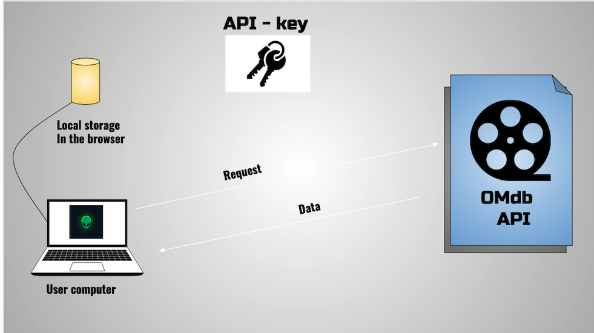

# MOVIE_CUT

## Introduction

This application is a blog dedicated to the cinema an it is linked to Ombd API.

- The user has to create an account.

- Then he has to login to access both the blog and the application interface.

- On the blog page the user is free to publish an article.

- He can make a request to the OMbd API and access to the movies library.

- He can create a playlist and store the movies as favourite, the favourite will
be stored in the browsers.

- The user can delete the movies.

### Deployment

- Still in development

- The applcation will be deployed on github pages.

### Author

- SEBASTIEN JONAD

- C#18 LAVAL Campus (Fance)

`sebastien-jonad@gmail.com`
